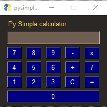
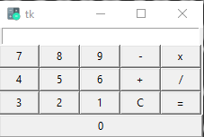

# GUI_Calculator
this project a simple calculator has been developed, The GUI calculator using the Tkinter and pysimpleGUI and there diffrence from each other in derms of design and size of the code as well as the amount of the code and difficulity of it. 

### Screenshots
pysimpleGUI           |   Tkinter
:---------------------:|:-----------------
 | 